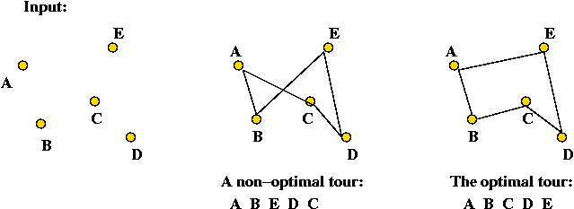
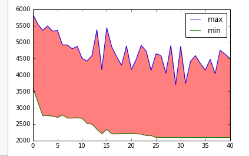

# genetic_algorithms
##Comparative analysis of crossover techniques for Genetic Algorithms solving TSP &amp; k-colorable graph problems
'Genetic Algorithms' solve problems by generating a population of candidate solutions, and simulating evolution on the candidate solutions to derive even better solutions. Ancestors pass down favorable traits to their offspring, and new solutions are created according to parameters (elitism, mutation rate) determined relevant to the problem at hand. 

##Travelling Salesman Problem
TSP is a fundamental discrete optimization problem in computer science. A collection of nodes (cities) are connected by edges (e.g. paths or routes), with the goal being to find the shortest possible route through each city (e.g. the tour of minimum length). Total tour distance provides a useful utility function to determine the 'fitness' of each candidate solution in a given population.

Photo courtesy of Dr. Raul Simha GWU SEAS

## Crossover techniques
Crossover techniques designate exactly how a child inherits characteristics from parents. We compared Ordered, Partially-Matched, and Two-Point crossover techniques, and observed very similar results from the Partially Matched and Ordered Crossover. 

*Partially-Matched crossover*

*Ordered crossover*

*Two-Point crossover*
 
